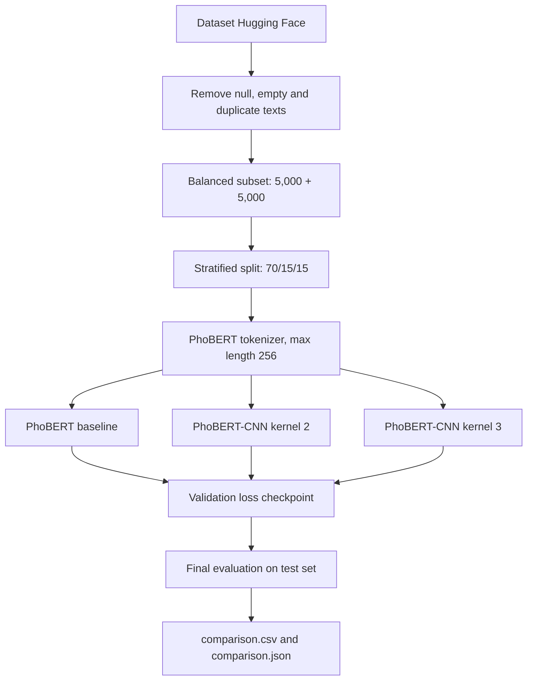

# PhoBERT-CNN: Nhận diện văn bản do người viết và AI tạo ra

## 1. Tổng quan đề tài

Đây là đồ án phân loại văn bản tiếng Việt thành hai nhóm `Human` và `AI`. Mục tiêu của đề tài là đánh giá xem việc bổ sung các lớp tích chập 1D trên biểu diễn ngữ cảnh của PhoBERT có giúp nhận diện văn bản tốt hơn so với mô hình PhoBERT cơ sở hay không.

Đề tài được triển khai theo quy trình thực nghiệm có kiểm soát:

```text
Dataset -> làm sạch -> cân bằng nhãn -> chia stratified 70/15/15
		-> huấn luyện 3 mô hình trên cùng dữ liệu -> đánh giá trên test set
```

### Mục tiêu nghiên cứu

- Xây dựng pipeline có thể tái lập cho bài toán phát hiện văn bản AI tiếng Việt.
- So sánh công bằng PhoBERT với hai biến thể PhoBERT-CNN.
- Đánh giá bằng Accuracy, Precision, Recall, F1-score và Loss.
- Lưu checkpoint tốt nhất theo validation loss, chỉ sử dụng test set ở bước cuối.

## 2. Các mô hình được so sánh

| Mô hình | Biểu diễn đầu vào | Thành phần phân loại | Ý nghĩa trong thí nghiệm |
| --- | --- | --- | --- |
| **PhoBERT** | Hidden states từ `vinai/phobert-base` | Masked mean pooling + Linear | Mô hình baseline, đo năng lực của encoder ngôn ngữ |
| **PhoBERT-CNN (2)** | Hidden states từ PhoBERT | CNN 1D kernel `(2,)` + max pooling + Linear | Bắt các mẫu cục bộ ngắn trong chuỗi biểu diễn |
| **PhoBERT-CNN (3)** | Hidden states từ PhoBERT | CNN 1D kernel `(3,)` + max pooling + Linear | Bắt mẫu cục bộ dài hơn một bước so với CNN-2 |

Trong hai biến thể CNN, đầu ra của PhoBERT được chuyển vị thành dạng `[batch, hidden_size, sequence_length]`. Sau đó, CNN, ReLU và global max pooling tạo vector đặc trưng trước khi đưa vào dropout và classification head.

## 3. Dữ liệu và tiền xử lý

Thí nghiệm mặc định sử dụng dataset `ICCIES-2025-DetectAI/vietnamese_news_human_ai` trên Hugging Face, split `train`.

| Hạng mục | Thiết lập |
| --- | --- |
| Bài toán | Binary text classification |
| Mẫu mỗi nhãn | 5.000 mẫu nhãn `0` và 5.000 mẫu nhãn `1` |
| Tổng số mẫu | 10.000 |
| Chia dữ liệu | Train 70%, validation 15%, test 15% |
| Kích thước dự kiến | 7.000 / 1.500 / 1.500 |
| Làm sạch | Loại dòng rỗng, giá trị thiếu và văn bản trùng lặp |
| Tokenizer | PhoBERT tokenizer |
| Độ dài tối đa | 256 tokens |
| Random seed | 42 |

Nhãn số được giữ nguyên theo dataset. Việc ánh xạ `0/1` sang `Human/AI` cần được xác nhận từ mô tả và phân bố thực tế của dataset, không được tự động đảo nhãn trong pipeline.

## 4. Thiết kế thực nghiệm

Ba mô hình được huấn luyện trên cùng một balanced subset, cùng cách chia stratified, tokenizer và hyperparameter. Checkpoint được chọn theo validation loss; test set không tham gia vào quá trình chọn mô hình.



### Hyperparameter chính

| Hyperparameter | Giá trị mặc định |
| --- | ---: |
| Epochs | 3 |
| Batch size | 8 |
| Learning rate | `2e-5` |
| Optimizer | AdamW |
| Weight decay | `0.01` |
| Dropout | `0.3` |
| Max sequence length | 256 |

## 5. Kết quả so sánh

Bảng dưới đây là kết quả thực nghiệm hiện có trên test set. Các chỉ số Precision, Recall và F1 là weighted average.

| Xếp hạng | Mô hình | Accuracy | Precision | Recall | F1-score |
| :---: | --- | ---: | ---: | ---: | ---: |
| 1 | **PhoBERT-CNN (2)** | **0.9913** | 0.99 | 0.99 | 0.99 |
| 2 | **PhoBERT** | 0.9873 | 0.99 | 0.99 | 0.99 |
| 3 | **PhoBERT-CNN (3)** | 0.9747 | 0.98 | 0.97 | 0.97 |

### Nhận xét

1. **PhoBERT-CNN (2) đạt kết quả tốt nhất** với Accuracy `0.9913`, cao hơn baseline PhoBERT khoảng `0.40` điểm phần trăm.
2. **CNN kernel 2 phù hợp hơn kernel 3** trên thiết lập hiện tại, cho thấy các đặc trưng cục bộ ngắn có thể hữu ích hơn đối với dữ liệu này.
3. **PhoBERT-CNN (3) giảm hiệu năng** so với hai mô hình còn lại. Nguyên nhân có thể liên quan đến kích thước receptive field, mức độ khớp dữ liệu hoặc hyperparameter chưa tối ưu cho kernel 3.
4. Chênh lệch giữa các mô hình cần được diễn giải cùng confusion matrix và nhiều seed hơn trước khi kết luận về khả năng tổng quát hóa.

## 6. Cài đặt

Từ thư mục `cd1`:

```powershell
python -m venv .venv
.\.venv\Scripts\Activate.ps1
python -m pip install --upgrade pip
pip install -r requirements.txt
pip install -e .
```

Nếu sử dụng GPU, cài phiên bản PyTorch tương thích với CUDA trước khi cài các dependency còn lại.

## 7. Chạy dự án

### Chạy giao diện Streamlit

Cài dependency và khởi động ứng dụng:

```powershell
pip install -r requirements.txt
streamlit run streamlit_app.py
```

Ứng dụng cung cấp ô nhập văn bản, lựa chọn mô hình, đường dẫn checkpoint, xác suất dự đoán và bảng so sánh ba mô hình. Nếu chưa có checkpoint, giao diện vẫn hiển thị phần tổng quan và bảng kết quả; để dự đoán thật, chạy `--compare` trước rồi nhập đường dẫn file `.pt`.

### Kiểm tra pipeline không tải PhoBERT

Smoke test sử dụng `TinyEncoder` và dữ liệu giả để kiểm tra preprocessing, training và metrics:

```powershell
python -m phobert_cnn.cli --smoke --output-dir artifacts/smoke
python -m pytest
```

### Huấn luyện một mô hình

```powershell
python -m phobert_cnn.cli `
	--batch-size 8 `
	--epochs 3 `
	--output-dir artifacts/experiment-10k
```

Kết quả gồm `best_model.pt` và `test_metrics.json`.

### So sánh ba mô hình

```powershell
python -m phobert_cnn.cli `
	--compare `
	--epochs 3 `
	--output-dir artifacts/comparison-10k
```

Lệnh trên tạo các file `comparison.csv`, `comparison.json` và checkpoint tốt nhất trong thư mục riêng của từng mô hình. Mỗi dòng trong bảng gồm `loss`, `accuracy`, `precision_weighted`, `recall_weighted` và `f1_weighted`.

### Sử dụng dữ liệu cục bộ

CSV hoặc JSON cần có hai cột mặc định là `Text` và `Label`:

```powershell
python -m phobert_cnn.cli `
	--source data/my_dataset.csv `
	--text-column Text `
	--label-column Label `
	--output-dir artifacts/local
```

## 8. Cấu trúc dự án

```text
cd1/
├── src/phobert_cnn/
│   ├── cli.py          # entry point, tham số và thực nghiệm so sánh
│   ├── data.py         # load, clean, cân bằng, split và tokenize dữ liệu
│   ├── model.py        # PhoBERT, PhoBERT-CNN và TinyEncoder
│   ├── training.py     # training loop, checkpoint và evaluation
│   └── metrics.py      # Accuracy, Precision, Recall, F1 và confusion matrix
├── tests/test_pipeline.py
├── artifacts/          # checkpoint và bảng kết quả thực nghiệm
├── requirements.txt
└── pyproject.toml
```

## 9. Hạn chế và hướng phát triển

- Kết quả hiện tại được đo trên một dataset và một random seed; cần chạy nhiều seed để báo cáo mean ± standard deviation.
- Nên bổ sung confusion matrix, classification report theo từng nhãn và khoảng tin cậy.
- Có thể mở rộng ablation với nhiều kernel size, learning rate và chiến lược freeze/unfreeze PhoBERT.
- Cần kiểm tra leakage giữa các nguồn văn bản và đánh giá thêm trên tập dữ liệu ngoài miền để đo khả năng tổng quát hóa.

## 10. Kết luận

Thực nghiệm cho thấy việc kết hợp PhoBERT với CNN kernel 2 đạt kết quả tốt nhất trong ba cấu hình được khảo sát. Pipeline đã tách riêng train, validation và test, có checkpoint theo validation loss và xuất bảng so sánh tự động, phù hợp làm nền tảng cho báo cáo đồ án cuối khóa về nhận diện văn bản AI tiếng Việt.

